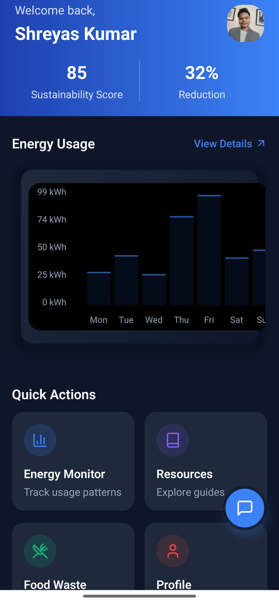

# 🚀 SustainLabs: Powering the Green Revolution


> Unifying renewable energy, AI, and blockchain for a sustainable, transparent, and efficient future.

---

## 📌 Problem Statement

**Problem Statement 2 – Accelerate Renewable Energy Adoption & Trust**

---

## 🎯 Objective

SustainLabs solves the fragmentation, inefficiency, and trust issues plaguing the renewable energy sector. Our platform unifies management, delivers real-time AI insights, ensures transparent green energy verification, and enables predictive maintenance empowering energy producers, consumers, and regulators to build a resilient, sustainable future.

---

## 🧠 Team & Approach

### Team Name:  
`Single Coders`

# 👥 Team Members
<table>
  <tr>
    <td align="center">
      <br>
      <b>Ayush Upadhyay</b><br>
      AI & Backend Lead<br>
      <a href="https://github.com/Ayushdevx">GitHub</a> | <a href="https://linkedin.com/in/ayushdevai">LinkedIn</a>
    </td>
    <td align="center">
      <br>
      <b>Shreyas Kumar</b><br>
      Frontend & UI/UX Lead<br>
      <a href="https://github.com/shkshreyas">GitHub</a> | <a href="https://linkedin.com/in/shkshreyas">LinkedIn</a>
    </td>
    <td align="center">
      <br>
      <b>Amrithesh Menon</b><br>
      Blockchain Integration Lead<br>
      <a href="https://github.com/im-Amrith">GitHub</a> | <a href="https://www.linkedin.com/in/amrithesh-s-menon-1a2b86277">LinkedIn</a>
    </td>
    <td align="center">
      <br>
      <b>Punya Mittal</b><br>
      Data Science & Analytics Lead<br>
      <a href="https://github.com/Punyamittal">GitHub</a> | <a href="https://www.linkedin.com/in/punya-mittal-a1122520b/">LinkedIn</a>
    </td>
  </tr>
</table>

### Our Approach:
- Tackled the complexity of integrating 9+ blockchains with a custom abstraction layer and dynamic routing.
- Built real-time data pipelines and edge computing for IoT energy data.
- Leveraged Groq's LPU for instant AI insights and federated learning for scalable model training.
- Designed context-aware dashboards and progressive disclosure for a delightful, non-overwhelming UX.
- Overcame data latency, cross-chain verification, and visualization overload with creative engineering and design sprints.

---

## 🛠️ Tech Stack

### Core Technologies Used:
- **Frontend:** React Native, Expo, TypeScript
- **Backend:** Node.js, Custom Blockchain Abstraction Layer
- **Database:** Supabase
- **APIs:** Groq LPU, Fluvio, Screenpipe, Stellar, Monad, Base
- **Hosting:** Expo, EAS Build

---

### 🪐 <span style="color:#00ffd0;">Blockchain Innovations</span>

<div align="center" style="background: linear-gradient(90deg, #232526 0%, #414345 100%); padding: 18px 0; border-radius: 18px; box-shadow: 0 2px 12px #00ffb3a0; margin-bottom: 24px;">
  <b style="color:#00ffd0; font-size:1.1em;">Multi-Chain Integration</b><br>
  <span style="color:#fff;">Seamlessly connects 9+ blockchains (Ethereum, Polygon, Aptos, Monad, Base, Stellar, Groq, InfinyOn, Screenpipe) via a custom abstraction layer.</span><br><br>
  <b style="color:#00ffd0; font-size:1.1em;">Dynamic Routing</b><br>
  <span style="color:#fff;">Intelligently routes transactions to the optimal chain for speed, cost, and sustainability.</span><br><br>
  <b style="color:#00ffd0; font-size:1.1em;">Cross-Chain Verification</b><br>
  <span style="color:#fff;">Parallel processing ensures instant, trustless verification of green energy claims across networks.</span><br><br>
  <b style="color:#00ffd0; font-size:1.1em;">Green Tokenization</b><br>
  <span style="color:#fff;">Stellar-based tokens for transparent energy credits and payments.</span>
</div>

### Sponsor Technologies Used:
- ✅ **Groq:** Real-time AI optimization with LPU acceleration
- ✅ **Monad:** High-throughput blockchain for IoT data
- ✅ **Fluvio:** Real-time energy data streaming
- ✅ **Base:** OnchainKit for smart wallet and L2 scaling
- ✅ **Screenpipe:** Visual data processing for sustainability analytics
- ✅ **Stellar:** Blockchain-based payments and green energy tokenization

---


---

## ✨ Key Features

- ✅ **Unified Dashboard:** Manage all renewable sources in one place
- ✅ **AI Energy Insights:** Real-time optimization and predictive maintenance
- ✅ **Blockchain Verification:** Transparent green energy claims and credit trading
- ✅ **Sustainability Scanner:** Smartphone-based health and sustainability tracking
- ✅ **Context-Aware Visualizations:** Role-based, adaptive dashboards
- ✅ **Recipe Suggestions by AI:** Reduce food waste with smart recommendations

### Demo Gallery

| Unified Dashboard                                                     | AI Energy Insights                                                   | EnviroLink AI Assistant                                              |
|:----------------------------------------------------------------------:|:---------------------------------------------------------------------:|:---------------------------------------------------------------------:|
| <br/>**Unified Dashboard** | <br/>**AI Energy Insights** | <br/>**EnviroLink AI Assistant** |

| Sustainability Scanner                                                 | Scanner – Real‑time Analysis                                         | Scanner – Results                                                     |
|:----------------------------------------------------------------------:|:---------------------------------------------------------------------:|:---------------------------------------------------------------------:|
| <br/>**Sustainability Scanner** | <br/>**Scanner – Real‑time Analysis** | <br/>**Scanner – Results** |

| AI Sustainability Analysis                                             | Energy Usage Overview                                                | Detailed Energy Metrics                                               |
|:----------------------------------------------------------------------:|:---------------------------------------------------------------------:|:---------------------------------------------------------------------:|
| <br/>**AI Sustainability Analysis** | <br/>**Energy Usage Overview** | <br/>**Detailed Energy Metrics** |

| Usage Trends                                                          | Food Wastage Reducer                                                 | Food Waste Insights                                                   |
|:----------------------------------------------------------------------:|:---------------------------------------------------------------------:|:---------------------------------------------------------------------:|
| <br/>**Usage Trends** | <br/>**Food Wastage Reducer** | <br/>**Food Waste Insights** |

| Recipe Suggestions by AI                                               | Splash Screen                                                         |                                                                      |
|:----------------------------------------------------------------------:|:---------------------------------------------------------------------:|:---------------------------------------------------------------------:|
| <br/>**Recipe Suggestions by AI** | <br/>**Splash Screen** |                                                                      |
---

## ✅ Tasks & Bonus Checklist

- ✅ **All members of the team completed the mandatory task - Followed at least 2 of our social channels and filled the form**
- ✅ **All members of the team completed Bonus Task 1 - Sharing of Badges and filled the form (2 points)**
- ✅ **All members of the team completed Bonus Task 2 - Signing up for Sprint.dev and filled the form (3 points)**

*(Mark with ✅ if completed)*

---

## 🧪 How to Run the Project

### Requirements:
- Node.js (v18+ recommended)
- Expo CLI
- API Keys (see `.env.example`)
- Supabase credentials

### Local Setup:
```bash
# Clone the repo
git clone https://github.com/shkshreyas/EnviroLink-APK

# Install dependencies
cd EnviroLink-APK
npm install

# Start development server
npm run dev
```

- For backend or blockchain services, see respective folders and setup guides.
- Ensure `.env` and `google-services.json` are properly configured (see `.gitignore` for sensitive files).

---

## 🧬 Future Scope

- 📈 Integrate more renewable sources and IoT devices
- 🛡️ Enhance security and privacy for cross-chain transactions
- 🌐 Expand localization and accessibility features
- 🤝 Enable community-driven sustainability initiatives

---

## 📎 Resources / Credits

- Groq, Monad, Fluvio, Base, Screenpipe, Stellar
- Supabase, Expo, React Native, TypeScript
- Open source libraries and APIs
- Special thanks to hackathon organizers and mentors

---

## 🏁 Final Words

Our journey was a whirlwind of late-night coding, cross-chain chaos, and breakthrough moments. We learned, pivoted, and built something we truly believe can accelerate the green revolution. Thanks for joining us on this mission let's power a sustainable future together!
